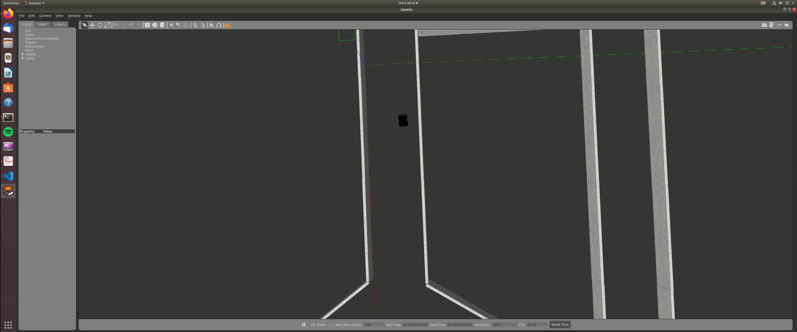

# Wall-Following-Robot

Wrote a Feed-back contreoller that makes the robot follow differential drive dynamics and the wall on the left. 

In this the PID control is implemented for a robot to maintain a certain distance from wall and follow the wall through curves as well. 

## Requirements

- Ubuntu 18.04
- ROS(melodic)
- Gazebo 9
- numpy, scipy, git
- python 2 or 3

## Robot in motion
	

## Support

For any questions contact  me at gurashish1000@gmail.com
